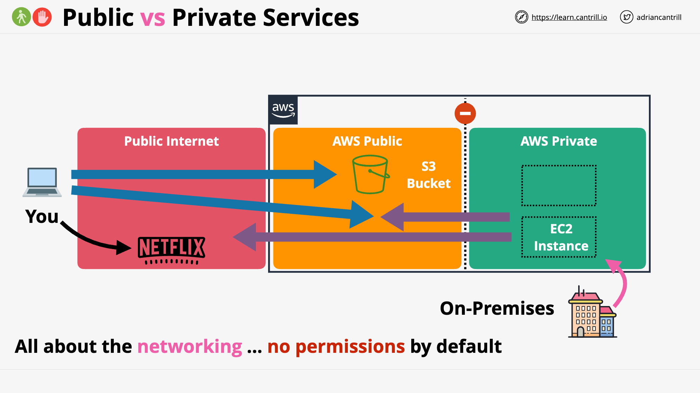

# AWS Solutions Architect Associate [SAA-C03]

This page contains notes primarily from Adrian Cantrill’s [AWS Solutions Architect - Associate (SAA-C03)](https://learn.cantrill.io/p/aws-certified-solutions-architect-associate-saa-c03). These notes should enable you to answer most, if not all, of the questions you may encounter in the exam.

## Table of Contents

- [Study Resources](#study-resources)
- [Accounts - IAM Basics](#-accounts---identity-and-access-management-iam-basics)
  - [Account and IAM Basics](#account-and-iam-basics)
  - [IAM Access Keys](#iam-access-keys)
- [Cloud Computing Fundamentals](#️-cloud-computing-fundamentals)
  - [Essential Characteristics of Cloud Computing](#essential-characteristics-of-cloud-computing)
  - [Public vs Private vs Hybrid vs Multi Cloud](#public-vs-private-vs-hybrid-vs-multi-cloud)
  - [Cloud Service Models](#cloud-service-models)
  - [YAML Basics](#yaml---yaml-aint-markup-language)
- [AWS Fundamentals](#-aws-fundamentals)
  - [Public vs Private Services](#public-vs-private-services)
  - [AWS Global Infrastructure](#aws-global-infrastructure)
  - [Virtual Private Cloud (VPC) Basics](#virtual-private-cloud-vpc-basics)
  - [Elastic Compute Cloud (EC2) Basics](#elastic-compute-cloud-ec2-basics)
  - [Simple Storage Service (S3) Basics](#simple-storage-service-s3-basics)
  - [CloudFormation Basics](#cloudformation-basics)
  - [CloudWatch Basics](#cloudwatch-basics)
  - [Shared Responsibility Model](#shared-responsibility-model)
  - [High-Availability vs Fault-Tolerance vs Disaster Recovery](#high-availability-ha-vs-fault-tolerance-ft-vs-disaster-recovery-dr)
- [DNS and Network Concepts](#domain-name-system-dns-basics)
  - [DNS Basics](#dns-101)
  - [Route53 Fundamentals](#route53-fundamentals)
  - [DNS Record Types](#dns-record-types)
- [IAM, Account and AWS Organizations](#-iam-account-and-aws-organizations)
  - [IAM Identity Policies](#iam-identity-policies)
  - [IAM Users and ARNs](#iam-users-and-arns)
  - [Amazon Resource Name (ARN)](#amazon-resource-name-arn)
- [Machine Learning Services](#-machine-learning-services)
  - [Natural Language Processing Services](#natural-language-processing-services)
  - [Conversational AI Services](#conversational-ai-services)
  - [Computer Vision Services](#computer-vision-services)
  - [Audio Processing Services](#audio-processing-services)
  - [Business Intelligence Services](#business-intelligence-services)
  - [Comprehensive ML Platform](#comprehensive-ml-platform)
  - [AWS Local Zones](#aws-local-zones)
- [Exam Tips and Practice Questions](./exam_tips_glossary.md)
- [AWS Terminology Glossary](./exam_tips_glossary.md#aws-terminology-glossary)
- [Practice Questions](./exam_tips_glossary.md#practice-questions)

---

## Study Resources

| Resource Type | Name | Published | Link |
|---------------|------|-----------|------|
| **Video Course** | Adrian Cantrill - AWS Certified Solutions Architect Associate (SAA-C03) | 2023 | [Course Link](https://learn.cantrill.io/p/aws-certified-solutions-architect-associate-saa-c03) |
| **Practice Tests** | Tutorials Dojo - AWS Certified Solutions Architect Associate | 2023 | [AWS Cheat Sheets](https://tutorialsdojo.com/aws-cheat-sheets/) |
| **Community Notes** | Alberto Lozano's AWS SAA-C02 Course Notes | 2021 | [GitHub Repo](https://github.com/alozano-77/AWS-SAA-C02-Course#16-elastic-cloud-compute-ec2) |
| **Official Docs** | AWS Certified Solutions Architect - Associate Exam Guide | 2023 | [AWS Certification](https://aws.amazon.com/certification/certified-solutions-architect-associate/) |

---

# 🧔 Accounts - Identity and Access Management (IAM) Basics

## Account and IAM **Basics**

💡 **AWS Account:** Container for **identities** (users) and **resources.** 

Account **root user** has full control over all of the AWS account and any resources created within in. The root user can’t be restricted. 

IAM **User Groups** and **Roles** can also be created and given full or limited permissions. All identities start with no permissions. 

May be good practice to create multiple AWS Accounts for different uses (prod, dev, test).


- Every AWS account comes with its own running copy of IAM, which is a database.
- IAM is a globally resilient service, so any data is always secure across all AWS regions. (Exam Q)
- The IAM in each of your accounts is your own dedicated instance of IAM, separate from other accounts.
- IAM
    - User
        - IDs which represent humans or apps that need access to your account
    - Group
        - Collection of related users, e.g. dev team, finance or HR
    - Role
        - Can be used by **AWS Services**, or for granting **external access** to your account
        - Used when the number of things is uncertain.
- IAM Policy
    - Allow or deny access to AWS services when and only when they’re attached to IAM users, groups or roles.
- IAM three main jobs
    - **Manage identities** - *An ID Provider (IDP)*
        - Create, modify and delete IDs such as users and roles
    - **Authenticate identities**
        - Prove you are who you claim to be - generally username and passwords
    - **Authorize**
        - Allow or deny access to resources
- IAM is provided for free
    - No cost for users, groups and roles. Limits for number of each.
- IAM is global service.
- Allow or deny its ids on its AWS account
- No direct control on external accounts or users - only control local ids in your account
- **Identity federation and MFA**
    - Use Facebook, Twitter, Google etc. to access AWS resources

## IAM Access Keys

- Long-term credentials
    - Don’t update manually
- IAM User don’t need username and password - for CLI access key is enough
- IAM User can have up to two access keys
    - Can be created, deleted, made inactive or made active

### Access Keys consist of two parts

- Both are provided when created an access key
- These are only provided once - no ability to get access to the keys again. Need to be stored safely.
- Both parts are used when accessing AWS via CLI
- Access keys need to be deleted and recreated if they are leaked
- Possible to have two sets of keys such that you can create a new one, update all applications using the keys and then delete the old set

**Access Key ID:** ABABABABABABABA

**Secret Access Key:** oierWRhoefWORIOF/DFLWAnljef


# ☁️ Cloud Computing Fundamentals

## Essential Characteristics of Cloud Computing

💡 **On demand self-service:** A consumer can unilaterally provision computing capabilities, such as server time and network storage, as needed automatically without requiring human interaction with each service provider. 
*Can provision capabilities as needed without requiring human interaction.*

`Provision and terminate using a UI/CLI without human interaction.`

**Broad network access:** Capabilities are available over the network and accessed through standard mechanisms that promote use by heterogeneous thin or thick client platforms (e.g., mobile phones, tablets, laptops, and workstations). 
*Capabilities are available over the network and accessed through standard mechanisms.*

`Access services over any networks, on any devices, using standard protocols and methods.`

**Resource pooling:** The provider’s computing resources are pooled to serve multiple consumers using a multi-tenant model, with different physical and virtual resources dynamically assigned and reassigned according to consumer demand. There is a sense of location independence in that the customer generally has no control or knowledge over the exact location of the provided resources but may be able to specify location at a higher level of abstraction (e.g., country, state, or datacenter). Examples of resources include storage, processing, memory, and network bandwidth. 
*There is a sense of **location independence**… no **control** or **knowledge** over the exact **location** of the resources. Resources are **pooled** to serve multiple consumers using a **multi-tenant model**.* 

`Economies of scale, cheaper service.`

**Rapid elasticity:** Capabilities can be elastically provisioned and released, in some cases
automatically, to scale rapidly outward and inward commensurate with demand. To the
consumer, the capabilities available for provisioning often appear to be unlimited and can
be appropriated in any quantity at any time. 
*Capabilities can be **elastically provisioned** and **released** to scale **rapidly** outward and inward with demand. To the consumers, the capabilities available for provisioning ofter **appear** to be **unlimited**.* 

`Scale UP (OUT) and DOWN (IN) automatically in response to system load.`

**Measured service:** Cloud systems automatically control and optimize resource use by leveraging a metering capability at some level of abstraction appropriate to the type of service (e.g., storage, processing, bandwidth, and active user accounts). Resource usage can be monitored, controlled, and reported, providing transparency for both the provider and consumer of the utilized service. 
*Resource usage can be **monitored, controlled, reported** and **BILLED**.*

`Usage is measured. Pay for what you consume.`


## Public vs Private vs Hybrid vs Multi Cloud

💡 **Public cloud:** AWS, Azure, Google. Meet the essential characteristics of cloud computing. 

**Multi-cloud:** Using more than one of the public cloud platforms. 

**Private cloud:** Run on business premises. AWS Outpost, Azure Stack, Anthos. 

**Hybrid cloud:** Using **private** cloud and **public** cloud in cooperation as a single environment.


## Cloud Service Models

> ***X** **a**s **a** **S**ervice*
> 

**Infrastructure Stack**

- Application
- Data
- Runtime
- Container
- OS
- Virtualization
- Servers
- Facilities

Parts **you** manage, parts managed by the **vendor**.

Unit of consumption is what makes each service model different - application vs OS

**XaaS Services**

**On-Premises**

- Application
- Data
- Runtime
- Container
- OS
- Virtualization
- Servers
- Infrastructure
- Facilities

**DC Hosted**

- Application
- Data
- Runtime
- Container
- OS
- Virtualization
- Servers
- Infrastructure
- ~~Facilities~~

*Data centre* 

**IaaS**

- Application
- Data
- Runtime
- Container
- **OS**
- ~~Virtualization~~
- ~~Servers~~
- ~~Infrastructure~~
- ~~Facilities~~

*EC2 uses the IaaS service model*

**PaaS**

- Application
- Data
- **Runtime**
- ~~Container~~
- ~~OS~~
- ~~Virtualization~~
- ~~Servers~~
- ~~Infrastructure~~
- ~~Facilities~~

*Heroku is a PaaS*

**SaaS**

- **Application**
- ~~Data~~
- ~~Runtime~~
- ~~Container~~
- ~~OS~~
- ~~Virtualization~~
- ~~Servers~~
- ~~Infrastructure~~
- ~~Facilities~~

*Netflix, Dropbox, Office 365 etc.*

++ Faas, CaaS, DBaaS


## 🗣YAML - *YAML Ain't Markup Language*

> Human readable data serialization language.
A YAML document is an unordered collection of key:value pairs, each key has a value.
YAML support strings, integers, floats, booleans, lists, dictionary.
> 

```yaml
cats: ["ben", "bin", "ban"]
# Same list can also be represented as below. Indentation matters.
cats:
	- "ben"
	- "bin" 
	- ban # values can be enclosed in "", '' or not - all valid but enclosing can be more precise

cats:
	- name: ben
		color: [black, white]
	- name: bin
		color: "mixed"
	- name: ban
		color: "white"
		numofeyes: 1

Resources:
	s3bucket:
		Type: "AWS::S3::Bucket"
		Properties:
			BucketName: "1337"
```


# 🐣 AWS Fundamentals

## Public vs Private Services


*Figure 1: AWS Public vs Private Services - VPC architecture showing the isolation of private services*

## AWS Global Infrastructure

**AWS Regions + AWS Edge Locations**

**Geographic Separation:** Isolated **Fault Domain**

**Geopolitical Separation:** Different **governance**

**Location Control:** Performance 

Region Code: us-east-1

Region Name: N. Virginia

**Availability Zone (AZ):** Level of granularity below regions. Isolated infrastructure within a region. 

us-east-1a, us-east-1b, …, us-east-1f

**Service Resilience:**

- **Globally** resilient: IAM and Route 53. Can tolerate failure of multiple regions without affecting service.
- **Region** resilient: If an AZ in a region fails, the service can continue operating. If all AZ fails, the service fails.
- **AZ** resilient

## Virtual Private Cloud (VPC) Basics

💡 A virtual network inside AWS

**A VPC is within 1 account & 1 region** ❗

Private and isolated unless you decide otherwise

Two types: Default VPC and Custom VPCs

**Custom VPCs used in almost all AWS deployments. More later.**

VPCs are created within a region. VPCs cannot communicate outside their network unless you specifically allow it. 
**By default a VPC is entirely private.**❗

**VPC CIDER (Classless Inter-Domain Routing):** Every VPC is allocated a range of IP addresses. If you allow anything to communicate to a VPC, it needs to communicate to that VPC CIDR. Any outgoing connection is going to originate from that VPC CIDR. Custom VPCs can have multiple CIDR ranges, but the default VPC only gets one, which is always the same.
❗**Default VPC IP range: 172.31.0.0/16** ❗

****Each subnet within a VPC is located within a AZ, and can never be changed. Default VPC is configured to have a subnet in every AZ. Each use a part of the IP range and cannot overlap. This is how a VPC is resilient.


### Default VPC Basic

- One per region - can be removed and recreated
- **Default VPC CIDR is always 172.31.0.0/16** ❗
- /20 subnet in each AZ in the region
- The higher the /number is the smaller the range. /17 is half the size of /16.
- **IGW: Internet Gateway**
    - VPC
- **SG: Security Group**
    - (EC2) Instances
    - Stateful
        - Incoming rule change = allow outgoing response traffic
            - Open port 80 for incoming will allow port 80 for outgoing response
    - Allow rules only
    - Instances can have multiple SGs
    - Allow CIDR, IP, SG as destination
- **NACL: Network Access Control List**
    - Subnet
    - Stateless
        - Open rule 80 for incoming does not allow port 80 for outgoing
    - Allow and deny rules
    - Subnets can have only one NACL
    - Only allow CIDR as destination
- Subnets assign public IPv4 addresses
- Best practice not to use default VPC


*Figure 2: Security Groups vs Network ACLs - Comparison of how these security layers operate at different levels of the VPC architecture*

Source: https://medium.com/awesome-cloud/aws-difference-between-security-groups-and-network-acls-adc632ea29ae

## Elastic Compute Cloud (EC2) Basics

> ***EC2 is AWS’s implement of IaaS - Infrastructure as a Service**
Default compute service within AWS.
Provide access to VMs known as instances*
> 

### EC2 Key Facts & Features

- IaaS - Provides Virtual Machines (Instances)
- **Private** service by default - uses VPC networking
- AZ resilient - Instance fails if AZ fails
- Different instance sizes and capabilities
- On-Demand Billing - **Per second**
- Local on-host storage or **Elastic Block Store (EBS)**
- Instance composition: CPU, memory, disk and networking. All four are billed when running. ❗
    - Only disk storage is billed when stopped (EBS).

### Instance Lifecycle

- Running
- Stopped
- Terminated

### Amazon Machine Image (AMI)

- An EC2 instance can be created from an AMI, or an EC2 can be used to create an AMI
- Contains
    - Permissions - who can and can’t use the AMI
        - Public - Everyone can launch instances from that AMI (Linux and Windows)
        - Owner - Implicit allow
        - Explicit - specific AWS accounts allowed
    - Boot Volume
        - The drive that boots the OS
    - Block Device Mapping
        - Links the volumes the AMI have
        - Mapping between volumes

### Connecting to EC2

- EC2 instances can run different OS’s
- Windows: **RDP - Remote Desktop Protocol**
    - Protocol Port 3389
- Linux: SSH protocol
    - Port 22

## Simple Storage Service (S3) Basics

- Global Storage Platform - regional based/resilient
    - Data is replicated across AZs in that region
- Public service, unlimited data & multi-user
- Movies, audio, photos, text, large data sets
- Economical & accessed via UI/CLI/API/HTTP
- Should be your default storing point
- **Objects** & **Buckets**
    - Objects is the data you store
    - Buckets are container for objects

### S3 Objects

- A file made up of two parts: key and value
    - E.g koala.jpg : koala-image
    - Value is the content being stored
- 0 - 5 TB data
- Version ID
- Metadata
- Access Control
- Subresources

### S3 Buckets

- Never leaves a region unless you configure it to do so
- A bucket is identified by its bucket name, which must be **globally unique**
    - Often AWS stuff is only unique within an account or region - bucket is exception to this
- Unlimited Objects
- Flat Structure - all objects are stored at root level in the bucket
    - Folders are prefixed names - but objects are still stored at the same level

### Summary

- Bucket names are **globally unique**
- 3-63 characters, all lower case, no underscores
- Start with a lowercase letter or a number
- Can’t be IP formatted e.g. 1.1.1.1
- Buckets - **100 soft limit, 1000 hard per account**
- Unlimited objects in bucket, **0 bytes to 5TB**
- Key = Name, Value = Data
- **ARN: Amazon Resource Name**

### S3 Patterns and Anti-Patterns

- S3 is an **object** store - not **file** or **block**
- S3 has no file system - it is flat
- You **can’t mount** an S3 bucket as (K:\ or /images)
- Great for large scale data storage, distribution or upload
- Great for **“offload”**
- **INPUT** and/or **OUTPUT** to **MANY AWS** products

## CloudFormation Basics

> ***CloudFormation is a Infrastructure as Code (IaC) product in AWS which allows automation infrastructure creation, update and deletion**
Templates created in YAML or JSON
Templates used to create stacks, which are used to interact with resources in an AWS account*
> 

### YAML

```yaml
AWSTemplateFormatVersion: "version date"

Description: # Must directly follow AWSTemplateFormatVersion if defined
	String

Metadata: # Control the UI
	template metadata

Parameters: # Add fields that prompt the user for more information
	set of parameters

Mappings: # Key/Value pairs which can be used for lookups
	set of mappings

Conditions: # Allow decision making. Create Condition / Use Condition. 
	set of conditions

Transform: 
	set of transforms

Resources: 
	set of resources

Outputs: # Outputs from the template being applied
	set of outputs
```

### Template Structure

CloudFormation templates have several key sections:

- **Resources** (Required): Defines the AWS resources you want to create
- **Parameters**: Input values that can be provided when creating/updating a stack
- **Mappings**: Key-value mappings for conditional parameter values
- **Conditions**: Statements that determine when resources are created
- **Outputs**: Values that are returned after stack creation/update

#### Example Template with Resources

```yaml
Resources:
  EC2Instance:
    Type: 'AWS::EC2::Instance'  # Logical Resource
    Properties:
      ImageId: !Ref LatestAmiId  # References a parameter
      InstanceType: !Ref InstanceType
      KeyName: !Ref KeyName
      SecurityGroups:
        - !Ref InstanceSecurityGroup
      UserData:
        Fn::Base64: !Sub |
          #!/bin/bash -xe
          yum update -y
          yum install -y httpd
          systemctl start httpd
          systemctl enable httpd

  InstanceSecurityGroup:
    Type: AWS::EC2::SecurityGroup
    Properties:
      GroupDescription: Enable SSH and HTTP
      SecurityGroupIngress:
        - IpProtocol: tcp
          FromPort: 22
          ToPort: 22
          CidrIp: 0.0.0.0/0
        - IpProtocol: tcp
          FromPort: 80
          ToPort: 80
          CidrIp: 0.0.0.0/0
```

The `!Ref` function retrieves the value of a parameter or resource, while `!Sub` substitutes variables in strings.

### Stack Concepts

A CloudFormation stack is a living implementation of a template:

- **Template to Stack Relationship**: Similar to a Class/Instance relationship in programming
- **Logical Resources**: Resources defined in the template (e.g., `EC2Instance`)
- **Physical Resources**: The actual AWS resources created from the logical resources
- **Stack Operations**:
  - **Create**: Provision all resources defined in the template
  - **Update**: Apply changes to an existing stack
  - **Delete**: Remove all resources within a stack

When you update a stack, CloudFormation determines which resources need to be:
- Created (new resources)
- Updated (modified existing resources)
- Replaced (when an update requires replacement)
- Deleted (removed resources)

**Practice Question**: What happens when you delete a CloudFormation stack?
- Answer: All resources created by the stack are terminated and deleted.

**Practice Question**: When creating a CloudFormation template, which section is required and must be included?
- Answer: The Resources section is the only required section in a CloudFormation template.

---

## CloudWatch Basics

> *CloudWatch is a core AWS monitoring service that provides metrics, logs, and event management capabilities for AWS resources and applications. It's essential for health monitoring, performance tracking, log management, and serverless architectures.*


*Figure 3: CloudWatch Architecture - Visual representation of how CloudWatch collects, processes, and alerts on metrics and logs*

### Key CloudWatch Components

#### 1. CloudWatch Metrics
- Collection of time-ordered data points about AWS resources and applications
- **Namespace**: Container that separates metrics for different services
  - AWS services use the format `AWS/service` (e.g., `AWS/EC2`)
  - Custom namespaces can be created for application metrics
- **Dimensions**: Name/value pairs that help identify a specific metric
  - Example: `InstanceId=i-1234567890abcdef0` for EC2 metrics
- **Datapoint**: Individual measurement consisting of:
  - Timestamp (e.g., `2023-06-11T08:45:45Z`)
  - Value (e.g., `98.3%` CPU utilization)

#### 2. CloudWatch Logs
- Centralized location for all logs from AWS services and applications
- Requires CloudWatch Agent for:
  - On-premises servers
  - EC2 instances (for OS-level metrics and logs)
  - Custom application logs

#### 3. CloudWatch Events/EventBridge
- Captures events from AWS services and custom applications
- Can create rules to respond to state changes
- Supports scheduled events (cron-like functionality)

#### 4. CloudWatch Alarms

| Alarm State | Description | Example Scenario |
|-------------|-------------|------------------|
| **OK** | Metric is within defined threshold | CPU usage < 70% |
| **ALARM** | Metric has breached threshold | CPU usage > 70% for 5 minutes |
| **INSUFFICIENT_DATA** | Not enough data to evaluate | Service just started collecting metrics |

**Practice Question**: What must be installed to collect OS-level metrics from an EC2 instance?
- Answer: The CloudWatch Agent must be installed on the instance.

---

## Shared Responsibility Model

> *The Shared Responsibility Model - is how AWS provide clarity around which areas of systems security are theirs, and which are owned by the customer.*
> 


- AWS responsible for the security of the cloud
    - Hardware/AWS Global Infrastructure
    - Regions, AZ, Edge Locations
    - Compute, Storage, Database, Networking
    - Software
- Customer responsible for security in the cloud
    - Client-side data encryption, integrity & authentication
    - Server-side encryption (File system and/or data)
    - Networking traffic protection (encryption, integrity, identity)
    - OS, Network and Firewall configuration
    - Platform, applications, identity and access management
    - Customer Data

## High-Availability (HA) vs Fault-Tolerance (FT) vs Disaster Recovery (DR)

These three concepts are critical for AWS Solutions Architects and are frequently tested in the exam.

---

### High-Availability (HA)

> *Aims to ensure an agreed level of operational performance, usually uptime, for a higher than normal period.* 
> **Maximizing a system's uptime / minimize outages.**

- **Uptime Metrics:**
  - 99.9% (Three 9's) = 8.77 hours/year downtime
  - 99.99% (Four 9's) = 52.6 minutes/year downtime
  - 99.999% (Five 9's) = 5.26 minutes/year downtime

- **Key Characteristics:**
  - Brief user disruption (e.g., re-login) is acceptable
  - Systems recover quickly but not necessarily seamlessly
  - Typically achieved through redundant components and failover mechanisms
  - Usually less expensive than fault-tolerance
  
- **AWS Services for HA:**
  - Auto Scaling Groups (ASG)
  - Elastic Load Balancing (ELB)
  - Multi-AZ deployments for RDS
  - Route 53 health checks and failover routing

---

### Fault-Tolerance (FT)

> *The property that enables a system to **continue operating properly** in the event of the **failure of some** (one or more) of its **components**.*
> **Operate through faults with no service disruption.**

- **Key Characteristics:**
  - No disruption when components fail
  - System continues to function with the same level of performance
  - Requires multiple levels of redundancy
  - More complex and expensive than high availability
  
- **AWS Services for FT:**
  - EBS Multi-Attach
  - Multi-region architectures with active-active configuration
  - S3 cross-region replication
  - DynamoDB global tables
  - RDS Multi-AZ with standby replicas

---

### Disaster Recovery (DR)

> *A set of policies, tools and procedures to enable the recovery or continuation of vital technology infrastructure and systems following a natural or human-induced disaster.*
> **Your last line of defense when HA and FT strategies fail.**

- **Key Characteristics:**
  - Focused on recovery from catastrophic events
  - Typically involves data backups, infrastructure replication, and recovery procedures
  - Often involves separate geographic regions
  - Recovery Time Objective (RTO) and Recovery Point Objective (RPO) are key metrics
  
- **DR Strategies in AWS:**
  - **Backup & Restore:** Lowest cost, longest recovery time
  - **Pilot Light:** Core systems running minimally, ready to scale
  - **Warm Standby:** Scaled-down but fully functional copy
  - **Multi-Site:** Full production environment in multiple regions

---

### Comparison Table

| Aspect | High-Availability | Fault-Tolerance | Disaster Recovery |
|--------|-------------------|-----------------|-------------------|
| **Goal** | Maximize uptime | Operate through failures | Recover from catastrophic events |
| **User Impact** | Brief disruption acceptable | No disruption | Planned recovery period |
| **Cost** | Moderate | Highest | Varies by strategy |
| **Implementation** | Redundant components | Multiple redundancies & automatic failover | Backup, replication & recovery procedures |
| **Example AWS Services** | Auto Scaling, ELB | S3 CRR, DynamoDB Global Tables | AWS Backup, CloudEndure Disaster Recovery |

---

### Practice Questions

1. **Question:** Your company needs to ensure that its e-commerce platform remains operational even if an entire AWS region fails. Which approach should you implement?
   - **Answer:** A multi-region active-active architecture with Route 53 routing would provide the necessary fault tolerance for region-wide failures.

2. **Question:** What's the main difference between High-Availability and Fault-Tolerance in AWS architectures?
   - **Answer:** High-Availability aims to recover quickly from failures with minimal downtime, while Fault-Tolerance allows systems to continue operating with no disruption despite component failures.


*Figure: Visual representation of the Shared Responsibility Model showing AWS's responsibility for the cloud infrastructure and customer's responsibility for their applications and data*

## Domain Name System (DNS) Basics

### DNS 101

- DNS is a **discovery service**
- Distributed database
- Translates machine into human and vice-versa
- [amazon.com](http://amazon.com) → 104.98.34.131
- It’s **huge** and has to be distributed
- Zone files that can be queried

### ❗Remember these ❗

- **DNS Client:** Your laptop, phone, tablet, PC, etc.
- **Resolver:** Software on your device, or a server which queries DNS on your behalf
- **Zone:** A part of the DNS database (e.g. amazon.com)
- **Zonefile:** Physical database for a zone
- **Nameserver:** Where zonefiles are hosted

### DNS Root

- Starting point of DNS
- www.amazon.com
    - Read right to left
- Hosted on 13 Root servers
    - Operated by 12 different large companies and organization
    - Only operates the servers, not the database itself
    - Each root server can be a cluster of servers
- Root Hints
    - Provided by Vendor
    - List of these root servers, pointer to DNS root servers
- Root Zone is operated by IANA - Internet Assigned Numbers Authority

### DNS Hierarchy

- Root zone - Database of top level domains | IANA
    - .com, .org, .uk, etc.
- .com zone | Verisign
    - amazon.com
    - NS - w.x.y.z
- [amazon.com](http://amazon.com) zone
    - www ⇒ 104.98.34.131

### Registry

- Organization that maintains the zones for a TLD

### Registrar

- Organization with relationship with .org TLD zone manager allowing domain registration

### DNS Resolution


### ❗Remember these❗

- **Root hints:** Config points at the root servers IPs and addresses
- **Root Server:** Hosts the DNS root zone
- **Root zone:** Point at TLD authoritative servers
- **gTLD:** generic Top Level Domain (.com .org etc)
- **ccTLD:** country-code Top Level Domain (.uk, .eu, etc)

## Route53 Fundamentals

### R53 Basics

- **Register** domains
- Host **Zones** … managed **nameservers**
- Global servers … single database
- Globally Resilient

### Register domains

- Registries
    - .com .io .net
- Create a zonefile
    - animals4life.org
- Put zonefile to four nameservers

### Hosted Zones

- **Zone files** in AWS
- Hosted on four managed name servers
- Can be **public**
- Or **private** … linked to **VPC(s)**
- Stores records (**recordsets)**

## DNS Record Types

### Nameserver (NS)

- Record types that allow delegation to occur in DNS
- .com zone
    - Multiple nameserver records inside it for amazon.com
        - Point at servers managed by the [amazon.com](http://amazon.com) team

### A and AAAA Records

- Map host names to IP
- A: www → ipv4
- AAAA: → ipv6

### CNAME Records

- Host to host
- ftp, mail, www (references) → A server
- Cannot point directly at an IP address, only other names

### MX Records

- Important for email
- MX records are used as part of the process of sending email
- E.g. inside [google.com](http://google.com) zone
    - MX 10 mail
        - means mail.google.com
    - MX 20 mail.other.domain.
        - Fully qualified domain name
        - means mail.other.domain
    - Lower values for the priority field means higher priority
    - MX 20 is only used if MX 10 doesn’t work

### TXT Records

- Allow you to add arbitrary text to a domain
- E.g. [animals4life.org](http://animals4life.org) zone
    - Add: TXT cats are the best
    - Important to prove that you own domain (animals4life.com)

### TTL - Time To Live

- TTL 3600 (seconds)
    - Value configured by [amazon.com](http://amazon.com) admin
    - Results of query stored at the resolver server for 1 hour
    - **Authoritative:** Query results directly from [amazon.com](http://amazon.com) server
    - **Non-authoritative:** If another client queries the resolver within 3600 seconds, the resolver can immediately return the results of the query
    
    
    


# 🦠 IAM, Account and AWS Organizations

## IAM Identity Policies

- Users, groups and roles
- Grants access or denies access

### **IAM Policy Document**

- At high level just one or more statements that grant or deny access
- Need to identify
- Statement only applies if the interaction with AWS match the action and the resource
- Wildcards (*) match any action
- Effect defines what to do if the action and resource match
- Often statements overlap, and you may be allowed and denied at the same time.
- **Explicit denies are first priority. Deny always win.**
- Priority list
    1. **Explicit DENY**
    2. **Explicit ALLOW**
    3. **Default DENY**

```json
{
	"Version": "2012-10-17",
	"Statement": [
		{
			"Sid": "Fullaccess", # StatementID
			"Effect": "Allow",
			"Action": ["s3:*"],
			"Resource": ["*"],
		},
		{
			"Sid": "DenyCatBucket",
			"Effect": "Deny",
			"Action": ["s3:*"],
			"Resource": ["arn:aws:s3:::catgifs", "arn:aws:s3:::catgifs/*"],	
		}
	]
}
```

### Inline Policy

- Write a JSON for multiple users individually
    - Bad practice for many users - have to change a lot of JSONs if there are 100 users
- Only use in special or exceptional allow or deny situations

### Managed Policy

- Reusable
- Low management overhead
- Should be the default

## IAM Users and ARNs

> *IAM Users are an identity used for anything requiring **long-term** AWS access e.g. **humans, applications or service accounts***
> 
- **Principal:** Something or someone wanting access resources in AWS
    - Must authenticate to gain access
        - Access Keys
        - Username/password
- When a principal is authenticated, it is known as a **authenticated identity**
- When the authenticated user tries to do an action, e.g. upload something to a S3 bucket, IAM checks that the authenticated user have access to perform that action (authorization)

## Amazon Resource Name (ARN)

> Uniquely identify resources within any AWS accounts
> 

```yaml
aws:partition:service:region:account-id:resource-id
aws:partition:service:region:account-id:resource-type
aws:partition:service:region:account-id:resource-type:resource-id

arn:aws:s3:::catgifs # Bucket
arn:aws:s3:::catgifs/* # Objects in bucket

# These two don't overlap. First is access to manage the bucket, second is to manage objects in bucket. 
```

- **5000 IAM Users per account**
- IAM User can be a member of 10 groups
- This has systems design impacts
    - Internet-scale applications
    - Large orgs and org merges
- IAM Roles and Identity Federation fix this (more later)

## IAM Groups

> ***IAM Groups are containers for Users***
> 
- Allow for easier management
- Groups can have (identity) policies attached to them
    - Users can have individual (identity) policies too
- Trick question exam: “All users” group does not exist natively (but you can technically create it)
- ❗300 groups ❗
- ❗10 groups per user ❗
- **No nesting**
- Resource policies (e.g. for a bucket) can allow one or more specific user to allow access
- **Resource policies cannot grant access to a group!**
    - Further, cannot be referenced from a resource policy at all

## IAM Roles

> *An IAM role is an IAM identity that you can create in your account that has specific permissions. An IAM role is similar to an IAM user, in that it is an AWS identity with permission policies that determine what the identity can and cannot do in AWS. However, instead of being uniquely associated with one person, a role is intended to be assumable by anyone who needs it. Also, a role does not have standard long-term credentials such as a password or access keys associated with it. Instead, when you assume a role, it provides you with temporary security credentials for your role session.

-* https://docs.aws.amazon.com/IAM/latest/UserGuide/id_roles.html
> 
- Role best suited for unknown number of principals or more than 5000 users
- IAM Roles are assumed. You become that role.
- ❗**Two types of policy for a role:**❗
    - **Trust policy**
    - **Permissions policy**
- If a role is assumed by something that is allowed to assume it, temporary security credentials are created.
    - ❗**STS: Secure Token Service** ❗
        - Generates the security tokens
        - sts:AssumeRole
    - Permissions policy define what they have access to
    - When they expire the role has to be assumed again to regain access

### ❓When to use IAM Roles

- Most common use case is for other AWS services
- E.g. AWS Lambda
    - No permissions by default
    - **Lambda Execution Role**
    - Runtime environment assumes the role.
    - Better to use a role than to hardcode access keys to the Lambda function
- Emergency or unusual situations
- E.g. team with read-only access:
    - 99% read-only access is OK
    - “Break glass for key”
    - User of team can assume an emergency role to perform a certain write action
- A corporation with > 5000 ids
    - **ID federation**
    - Can allow an organization to use previous existing accounts for SSO (Active Directory)
    - AD users are allowed to assume a role to gain access to e.g. a bucket
- App with millions of users
    - **Web Identity Federation**
    - Users might need to interact with a DynamoDB
    - Users are allowed to assume a role to interact with the db
    - No AWS credentials on the app
    - Uses existing customer logins (twitter, fb, google)
    - Scales to large number of accounts
- Cross AWS accounts

## Service-linked Roles & PassRole

> A service-linked role is a unique type of IAM role that is linked directly to an AWS service. Service-linked roles are predefined by the service and include all the permissions that the service requires to call other AWS services on your behalf. The linked service also defines how you create, modify, and delete a service-linked role. A service might automatically create or delete the role. It might allow you to create, modify, or delete the role as part of a wizard or process in the service. Or it might require that you use IAM to create or delete the role.
> 
- IAM role linked to a specific AWS service
- Predefined by a service
- Providing permissions that a service needs to interact with other AWS services on your behalf
- Or allow you to during the setup or within IAM
- You can’t delete the role until it’s no longer required
- **PassRole**: Grant a user permission to pass a role to an AWS service
    - Bad: Bob may create and assign a role to a AWS service that has permissions that exceeds the permissions that Bob has himself
        - E.g. create resources
    - Good: Bob cannot assign roles with permissions that exceeds his own
    

## AWS Organizations

> *Suitable for organization with multiple AWS accounts*
> 


- Use a standard AWS account to create a AWS organization
    - This account will be the **management account** or **master account - can only be one**
    - The organization is not *within* the AWS account
- Invite other standard accounts into the organization
- Organization Root is a container within AWS Organization which contains either **other AWS account or other organizational units**
- Consolidated billing: Member accounts pass their billing to the payment/management/master account
    - Removes financial overhead
    - Consolidation of reservation and volume discounts
- **Two important concepts of AWS Organizations:**
    - In a organization you can create accounts directly within the organization - one step process instead of invitation
    - Don’t need to have IAM Users inside every AWS account. IAM Roles can be used. Can role switch into different accounts.

## Service Control Policies (SCP)

> JSON doc with policies. Can be attached to organizations as a whole. Cascade to all orgs below that which it is attached to.
**Management account is special and is unaffected by SCP!**
> 


- SCPs are **account permissions boundaries**
- They limit what the account (including account root user) can do
- SCPs can e.g. limit the size of an EC2 instance within a specific region
- **SCPs don’t grant any permissions!**
- **Allow list vs Deny list**
    - Default is a deny list
    - FullAWSAccess Default for new account
    - DenyS3 - Deny S3 to organizations - even though they have FullAWSAccess (deny, access, deny)
- To implement allow list:
    - Remove FullAWSAccess - add a new list: AllowS3EC2
        - Explicit say which services are allowed
        - More overhead, may block access to services you don’t intend to block
- Best practice is deny list architecture


## CloudWatch Logs

> *CloudWatch Logs is a service which can accept logging data, store it and monitor it.
It is often the default place where AWS Services can output their logging too.
CloudWatch Logs is a public service and can also be utilized in an on-premises environment and even from other public cloud platforms.*
> 

💡 **Public Service:** Usable from AWS or on-premises


- **Store, Monitor** and **access** logging data
- **AWS Integrations** - EC2, VPC Flow logs, Lambda, CloudTrail, R53 and more
- **Metric filter:** Can generate metrics based on logs
- Regional service


## CloudTrail Essentials

### CloudTrail Basic


- Logs API calls/activities as a **CloudTrail Event**
- 90 days stored by default in **Event History**
- Enabled by default - no cost for 90 day history. No S3.
- To customize the service, create one or more **Trails**
- **Management events**
    - Provide information about management operation that are performed on resources in your AWS account
    - AKA **Control Plane Operations**
    - Create EC2 instance etc
    - **Enabled by default** ❗
- **Data events**
    - Objects being uploaded to S3
    - Lambda being invoked
    - **Not enabled by default. Come at an extra cost.** ❗
- Trails can be set to one region or all regions
- Organizational trail - it is what it sounds like
- **Trails are how you configure S3 and CWLogs.**
- Management event **only** by default
- **IAM, STS, CloudFront → Global Service Events**
    - Only these logs global
- **NOT REALTIME** - There is a delay
    - Typical 15 minutes ❗

## AWS Control Tower

> *AWS Control Tower offers a straightforward way to set up and govern an AWS multi-account environment, following prescriptive best practices. AWS Control Tower orchestrates the capabilities of several other [AWS services](https://docs.aws.amazon.com/controltower/latest/userguide/integrated-services.html), including AWS Organizations, AWS Service Catalog, and AWS IAM Identity Center (successor to AWS Single Sign-On), to build a landing zone in less than an hour. Resources are set up and managed on your behalf.

AWS Control Tower orchestration extends the capabilities of AWS Organizations. To help keep your organizations and accounts from drift, which is divergence from best practices, AWS Control Tower applies preventive and detective controls (guardrails). For example, you can use guardrails to help ensure that security logs and necessary cross-account access permissions are created, and not altered.*
> 


- Quick and easy setup of multi-account environment
- Orchestrates other AWS services to provide this functionality
- Organizations, IAM Identity Center, CloudFormation, Config and more
- Landing Zone - multi-account environment
- SSO/ID Federation, Centralized Logging and Auditing
- Guard Rails - Detect/Mandate rules/standard across all accounts
- Account Factory - Automates and standardizes new account creation
- Dashboard - single page oversight of the entire environment

### Landing Zone

- **Well Architected** multi-account environment. **Home region.**
- Built with AWS Organizations, AWS Config, CloudFormation
- Security **OU (Organizational Unit)** - Log Archive and Audit Accounts (CloudTrail & Config Logs)
- Sandbox OU - Test/less rigid security
- You can create other OU’s and Accounts
- IAM Identity Center (AWS SSO) - SSO, multiple-accounts, ID Federation
- Monitoring and Notifications - CloudWatch and SNS
- End User account provisioning via Service Catalog

### Guard Rails

- Guardrails are rules for multi-account governance
- **Mandatory, strongly recommended** or **elective**
- **Preventive -** Stop you doing things (AWS ORG SCP)
- Enforced or not enabled
    - i.e. allow or deny regions or disallow bucket policy changes
- Detective - compliance checks (AWS CONFIG Rules)
- Clear, in violation or not enabled
- Detect CloudTrail enabled or EC2 Public IPv4

### Account Factory

- **Automated Account Provisioning**
- Cloud admins or end users (with appropriate permissions)
- **Guardrails** - automatically added
- Account admin given to a named user (IAM Identity Center)
- Account & network standard configuration
- Account can be closed or repurposed
- Can be fully integrated with a business SDLC (Software Development Life Cycle)

## Practice Questions

1. **Question:** How many IAM users can you have per AWS account?
   - **Answer:** 5,000 IAM users per account (soft limit)

2. **Question:** Which IAM policy evaluation result takes precedence over all others?
   - **Answer:** Explicit Deny always takes precedence over any Allow statements

3. **Question:** What is the recommended way to give an EC2 instance permissions to access other AWS services?
   - **Answer:** Use IAM Roles with appropriate permissions policy attached to the instance

---

# 💾 Simple Storage Service S3

## S3 Security

> *S3 is private **by default***
> 

### S3 Bucket Policies

- A form of **resource policy** ❗
- Like identity policies, but attached to a bucket
- Resource perspective permissions
- ALLOW/DENY same or **different** accounts
- ALLOW/DENY **anonymous** principals
    
    
    

### Access Control Lists (ACLs)

- ACLs on objects and bucket
- A subresource
- **LEGACY!**❗
- Inflexible and simple permissions

### Block Public Access

- Fail safe

### Summary

- Identity: Controlling different resources
- Identity: You have a preference for IAM
- Identity: Same account
- Bucket: Just controlling S3
- Bucket: Anonymous or Cross-Account
- ACLs: **Never** - unless you must

## S3 Static Hosting

### Static Website Hosting

- Normal access is via **AWS APIs**
- This feature allows access via HTTP - e.g. Blogs
- **Index** and **Error** documents are set
- **Website Endpoint** is created
- Custom Domain via **R53** - Bucket name matters!
- **Offloading:** Large data files such as pictures can be saved in a static S3 bucket to offload the page being accessed
- **Out-of-band pages:** During maintenance of a server, configure DNS to point at an error HTML page hosted at static S3.


### S3 Pricing

- Per GB month charge ❗
- Every GB in is free ❗
- Every GB out of S3 is charged ❗
- GET, PUT, POST etc pricing per 1000 requests  ❗

## Object Versioning & MFA Delete

> **Once enabled, you can never disable it again! Can be suspended and reenabled. 
Versioning lets you store multiple versions of objects within a bucket. Operations which would modify objects generate a new version.** 

*Almost guaranteed to feature on the exam* ❗
> 
- Without versioning each object is identified by their key
- With versioning disabled on an object, the id of the object is set to null
- If an object is requested without specifying the id, you always retrieve the latest object
- If we delete an object without specifying id, the objects is not actually deleted but it adds a delete marker.
    - Delete markers can be deleted
- To fully delete you must provide the id of the object you delete
- **OBJECT VERSIONING CANNOT BE SWITCHED OFF**
- Space is consumed by all versions
- You are billed for all versions

### MFA Delete (Multi-Factor Authentication)

- Enabled in **versioning configuration**
- MFA is required to change bucket **versioning state**
- MFA is required to **delete versions**
- Serial number (MFA) + Code passed with API CALLS

## S3 Performance Optimization

### Single PUT Upload

- Single data stream to S3
- Stream fails - upload fails
- Requires full start
- Speed & reliability = limit of 1 stream
- Any upload to to 5 GB

### Multipart Upload

- Data is broken up
- **Min data size 100 MB**
- 10 000 max parts, 5MB → 5GB ❗
- Parts can fail, and be restarted
- Transfer rate = speed of all parts

### S3 Accelerated Transfer (Off)

- Uses the network of edge locations
- Default turned off
- Some restrictions to enable it
- Transfers data via the AWS network - more efficient than public internet
- Lower, consistent latency
- The worse the initial connection, the bigger the gain of uses accelerated transfer

## Key Management Service (KMS)

> **Regional & Public Service
Create, Store and Manage Keys
Symmetric and Asymmetric Keys
Cryptographic operations (encrypt, decrypt &…)
Keys never leave KMS - Provides FIPS 140-2 (L2)**
> 

### KMS Keys

- Consider it a container
- **Logical -** ID, date, policy, desc & state
- … backed by **physical** key material
- Generated or imported
- KMS Keys can be used for up to 4KB of data
- **Everything on disk is encrypted, never in plaintext form** ❗
    - **May be in plaintext in memory** ❗

### KMS and KMS Keys

> **CMK - Customer Managed Keys**
> 


### Data Encryption Keys (DEKs)

- **GenerateDataKey - works on > 4KB**
1. Plaintext Version → Lock (Encrypt data)
2. Ciphertext Version → Unlock (Decrypt data)
3. Encrypt data using plaintext key
4. Discard plaintext version
5. Store encrypted key with data

### Key Concepts

- KMS Keys are isolated to a region and lever leave
- Multi-region keys exist
- AWS Owned & Customer Owned
- Customer Owned: AWS Managed og *Customer Managed KEYS*
- Customer Managed keys are more configurable
- KMS Keys support rotation
- Backing Key (and previous backing keys)
- Aliases

### Key Policies and Security

- Key Policies (Resource)
- Every KEY has one
- Key Policies + IAM Policies
- Key Policies + Grants

```json
{
	"Sid": "Enable IAM User Permissions",
	"Effect": "Allow",
	"Principal": {"AWS": "arn:aws:iam:1122334455:root"},
	"Action": "kms:*",
	"Recource": "*"
}

{
	"Version": "2012-10-17",
	"Statement": {
		"Effect":"Allow",
		"Action": [
			"kms:Encrypt",
			"kms:Decrypt"
		]
		"Resource": [
			"arn:aws:kms:*:1122334455:key/*"
		]
	}
}
```

## S3 Encryption

> Buckets aren’t encrypted. **Objects are!**
> 
- **Client**-Side Encryption
    - Encrypted by client before upload
    - Keys, process, tooling
- **Server**-Side Encryption
    - Objects themselves aren’t encrypted. Reaches S3 in plaintext, and is then encrypted.

### Server-Side Encryption (SSE-C , SSE-S3 and SSE-KMS)

- Server-Side Encryption with Customer-Provided Keys **(SSE-C)**
    - Customer is responsible for keys used to encrypt/decrypt
    - S3 manages the actual encryption - no CPU requirement on client, but still need to manage the actual keys ❗
    - When uploading an object, provide **object and key** ❗
    - Encrypted objects is stored on S3
    - To decrypt you must provide a key to decrypt and specify the object you wish to retrieve
- Server-Side Encryption with Amazon S3-Managed Keys **(SSE-S3) [AES256]**
    - AWS Manages encryption & keys
    - S3 creates a root key
    - Creates a key thats unique for every object
        - This key encrypts plaintext object, then root key is used to encrypt that key
        - Original unencrypted version of this key is discarded
        - *?Root key decrypts unique key, that is again used to decrypt object?*
    - Cons:
        - No access to keys
        - No control over rotation of keys
        - No role separation
- Server-Side Encryption with KMS KEYS Stored in AWS KMS **(SSE-KMS)**
    - Root key is handled by KMS
    - The KMS key is used to generate a unique key for every object that is encrypted using SSE-KMS
    - You are not restricted to use the KMS Key provided på AWS. You can use your own customer-managed KMS key.
        - You can control permissions and rotation
    - **Role separation!** S3 admin with full access can’t see the unencrypted version of objects - need access to the KMS key
        
        
        
        | Method | Key Management | Encryption Processing | Extras |
        |  |  |  |  |
        | Client-Side | You | You |  |
        | SSE-C | You | S3 |  |
        | SSE-S3 | S3 | S3 |  |
        | SSE-KMS | S3 & KMS | S3 | Rotation Control
        Role Separation |
        
        
        
        ### Bucket Default Encryption
        
        - PUT operation when uploading
        - header
            - x-amz-server-side-encryption : “AES256” eller “aws:kms”
                - How you specify to use S3 encryption
                - AES-256: SSE-S3
                - aws:kms : SSE-KMS
        - Can set a default for a bucket when you don’t specify this header
        - Can also restrict what encryption is possible on a bucket

## S3 Object Storage Classes

### S3 Standard


### S3 Standard-IA (Infrequent Access)

> Cheaper! 
But, retrieval fee. Overall cost increases with frequent access.
> 


### S3 One Zone-IA


### S3 Glacier Instant

> Like S3 Standard-IA… cheaper storage, more expensive retrieval, longer minimum
> 


### S3 Glacier Flexible

> *Cold objects*
Objects cannot be made publicly accessible. Any Access of data requires a retrieval process.
> 


### S3 Glacier Deep Archive

> Cheapest alternative. LONG time to retrieve - hours to days.
> 


### S3 Intelligent-Tiering


## S3 Lifecycle Configuration

> Automatically transition or expire objects in a bucket. Optimize costs.
> 
- A lifecycle configuration is a **set of rules**
- Rules consist of **actions**
    - on a **bucket** or **groups of objects**
- Transition actions
    - e.g. to S3 Glacier
- Expiration actions
    - Delete object(s) after a certain time

### Transitions

> Sort of waterfall between the S3 Storage Classes
> 


## S3 Replication

- **CRR: Cross-Region Replication**
    - Replicate buckets across regions
- **Same-Region Replication:**
    - Replicate buckets within the same region
- Only differ by whether they are in the same or different account
- For different accounts:
    - Role is not trusted by default since its configured by another account
    - Add bucket policy to allow role
    
    
    

### S3 Replication Options

- **All objects** or a **subset**
- **Storage Class** - default is to maintain
- **Ownership** - default is the source account
    - Can override such that destination account is the owner
- **RTC: Replication Time Control**
    - Make sure that buckets are in sync
    - 15 minutes

### S3 Replication Considerations

- **Not retroactive!** Versioning needs to be ON
- **One-way replication:** Source to destination
    - Objects added to destination wont be added to source
- Unencrypted, SSE-S3 & SSE-KMS (with extra config)
    - Not SSE-C! ❗
- Source bucket owner needs permissions to objects
- No system events, Glacier or Glacier Deep Archive
    - Lifecycle actions wont be replicated at destination
    - Can’t replicate any objects within Glacier+
- NO DELETES
    - Delete markers are not replicated
    - Not enabled by default
    
    ### Why use replication?
    
    > SSR: Same Region Replication
    CRR: Cross Region
    > 
    - SSR - Log Aggregation
    - SSR - Prod and Test Sync
    - SSR - Resilience with strict sovereignty
    - CRR - Global Resilience Improvements
    - CRR - Latency Reduction

## S3 Presigned URLs

> *Give another person or application access to a object in a bucket using your credentials in a safe way!*
> 
- Expire at a certain time
- Person using URL is acting as the person who created the presigned URL
    - PUT, GET
- Offload media to S3
- You can create a URL for an object you have **no access to**
    - Few use cases, but possible
- When using the URL, the permissions match the **identity which generated**
- Access denied could mean the generating ID **never had access**, or **doesn’t now**
- **Don’t generate with a role**! URL stops working when the temporary credentials expire.


## S3 Select and Glacier Select

> *Ways to retrieve parts of objects rather than the object.
SQL-Like statement*
> 
- S3 can store objects up to 5 TB
- You often want to retrieve the entire objects
- S3/Glacier select let you use SQL-Like statements
    - select part of the object, pre-filtered by S3
- CSV, JSON, Parquet, BSZIP2 compression for CSV and JSON

### Architecture


## S3 Events

> *Receive notifications when certain events happen in your bucket*
> 

### S3 Notifications

- Notification generated when events occur in a bucket
    - can be delivered to SNS, SQS and Lambda functions
- Object Created (Put, Post, copy, CompleteMultiPartUpload)
- Object Delete (*, Delete, DelteMarkedCreated)
- Object Restore (Post(Initiated), Completed)
- Replication
- **Use EventBridge as default!**
    - Newer and adds support for more services and events


## S3 Access Logs

> *Provides detailed records for the requests that are made to a bucket*
> 


## S3 Object Lock

> *You can use S3 Object Lock to store objects using a write-once-read-many (WORM) model. It can help you prevent objects from being deleted or overwritten for a fixed amount of time or indefinitely. You can use S3 Object Lock to meet regulatory requirements that require WORM storage, or add an extra layer of protection against object changes and deletion.*
> 
- Object Lock enabled on “new” buckets* (Support for existing)
- Write-Once-Read-Many (**WORM) - No delete, No owerwrite**
- Requires **versioning - individual versions** are locked
- 1 - **Retention** Period
- 2 - **Legal Hold**
- **Both, One** or **the other**, or **none**
- A bucket can have **default object lock settings**

### Retention

- Specify **DAYS & YEARS -** A Retention Period
- **COMPLIANCE** - **Cant be adjusted, deleted, overwritten**
    - even by account root user
    - **until retention expires**
    - Use due to compliance
- **GOVERNANCE** - special **permissions** can be granted allowing lock settings to be adjusted
- **s3:ByPassGovernanceRetention**
    - x-ams-bypass-governance-retention:true (console default)

### Legal Hold

- Set on an **object version - ON or OFF**
    - No retention
- **NO DELETES** or changes until removed
- s3:PutObjectLegalHold is required to add or remove
- Prevent accidental deletion of object version


### Practice Questions

1. **Question:** What is the maximum size for an object in Amazon S3?
   - **Answer:** 5 TB (5 terabytes)

2. **Question:** What is the maximum number of buckets allowed per AWS account?
   - **Answer:** 100 soft limit, 1000 hard limit per account

3. **Question:** What happens when you enable versioning on an S3 bucket?
   - **Answer:** Each object may have multiple versions, and once enabled, versioning cannot be disabled (only suspended).

---

# 🤖 Machine Learning Services

AWS provides a comprehensive suite of machine learning and AI services that can be categorized into different functional areas. These services are commonly tested in the SAA-C03 exam.

## Natural Language Processing Services

### Amazon Comprehend

> *Natural-language processing (NLP) service that uses machine learning to uncover valuable insights and connections in text.*

**Key Features:**
- **Input:** Documents and text data
- **Output:** Entities, phrases, language detection, PII identification, sentiment analysis
- **Processing Options:** Real-time analysis or asynchronous batch jobs
- **Models:** Pre-trained models or custom models for specific use cases
- **Access:** Console, CLI, or APIs for application integration

**Common Use Cases:**
- Content analysis and categorization
- Social media monitoring
- Customer feedback analysis
- Document processing and compliance

---

### Amazon Kendra

> *Intelligent search service powered by machine learning that mimics interacting with a human expert.*

**Key Features:**
- **Question Types Supported:**
  - **Factoid:** Who, what, where questions
  - **Descriptive:** How-to questions
  - **Keyword:** Intent-based searches
- **Data Sources:** S3, Confluence, Google Workspace, RDS, OneDrive, Salesforce
- **Integration:** IAM, Identity Center (SSO)

**Core Components:**
- **Index:** Searchable data organized efficiently
- **Data Source:** Origin of data that Kendra connects to and indexes
- **Documents:** Both structured (FAQs) and unstructured (HTML, PDFs, text)

---

## Conversational AI Services

### Amazon Lex

> *Fully managed AI service for building conversational interfaces using voice and text.*

**Key Features:**
- **ASR (Automatic Speech Recognition):** Speech to text conversion
- **NLU (Natural Language Understanding):** Intent recognition
- **Integration:** Lambda functions for fulfillment logic
- **Applications:** Chatbots, voice assistants, Q&A bots

**Core Concepts:**
- **Bot:** Conversational interface supporting multiple languages
- **Intent:** Action the user wants to perform (e.g., "order pizza")
- **Slots:** Parameters for intents (e.g., size: small/medium/large)
- **Sample Utterances:** Different ways users might express an intent

---

### Amazon Polly

> *Text-to-speech service that converts text into lifelike speech.*

**Key Features:**
- **Input:** Text in various languages
- **Output:** Audio in MP3, Ogg Vorbis, or PCM format
- **Voice Types:**
  - **Standard TTS:** Concatenative synthesis using phonemes
  - **Neural TTS:** Advanced AI for more natural-sounding speech
- **SSML Support:** Speech Synthesis Markup Language for pronunciation control

**Advanced Capabilities:**
- Multiple speaking styles (e.g., "newscaster")
- Emphasis and pronunciation controls
- Whispering and other vocal effects

---

## Computer Vision Services

### Amazon Rekognition

> *Computer vision service for image and video analysis using deep learning.*

**Capabilities:**
- **Image Analysis:** Object detection, face detection/analysis/comparison
- **Video Analysis:** Activity recognition, pathing, live stream analysis
- **Content Moderation:** Inappropriate content detection
- **Text Recognition:** Extract text from images and videos

**Pricing Model:**
- Per image for image analysis
- Per minute for video analysis
- Integration with Kinesis Video Streams for live analysis

---

### Amazon Textract

> *ML service that extracts text, handwriting, and data from scanned documents using OCR and beyond.*

**Key Features:**
- **Input Formats:** JPEG, PNG, PDF, TIFF
- **Processing Types:**
  - **Synchronous:** Real-time for most documents
  - **Asynchronous:** For large documents (big PDFs)
- **Advanced Analysis:** Forms, tables, and document structure understanding

**Use Cases:**
- Document digitization and analysis
- Receipt processing (prices, vendors, dates)
- Identity document processing
- Form data extraction

---

## Audio Processing Services

### Amazon Transcribe

> *Automatic speech recognition (ASR) service that converts audio to text using ML models.*

**Features:**
- **Input:** Audio files or streaming audio
- **Output:** Accurate text transcriptions
- **Customization:** Custom vocabularies and language models
- **Advanced Features:** Speaker identification, privacy filters, audience-appropriate language

**Use Cases:**
- Meeting transcription and notes
- Subtitle and caption generation
- Call analytics and sentiment analysis
- Audio content indexing for search

---

### Amazon Translate

> *Neural machine translation service for fast, high-quality language translation.*

**Technical Approach:**
- **Encoder:** Reads source language and creates semantic representation
- **Decoder:** Converts meaning to target language
- **Attention Mechanisms:** Ensure meaning preservation
- **Auto-detection:** Automatically identifies source language

**Use Cases:**
- Multilingual user experiences
- Real-time chat translation
- Content localization
- Cross-language data analysis

---

## Business Intelligence Services

### Amazon Forecast

> *Fully managed service using statistical and ML algorithms for accurate time-series forecasting.*

**Capabilities:**
- **Data Types:** Retail demand, supply chain, staffing, energy consumption
- **Input:** Historical and related data
- **Output:** Forecasts with explainability
- **Access:** Web console with visualization, CLI, APIs, Python SDK

**Business Applications:**
- Demand planning and inventory management
- Resource capacity planning
- Financial forecasting
- Web traffic prediction

---

### Amazon Fraud Detector

> *Managed fraud detection service that automates detection of potentially fraudulent activities.*

**Model Types:**
- **Online Fraud:** For scenarios with little historical data
- **Transaction Fraud:** Uses transactional history to identify suspect payments
- **Account Takeover:** Detects phishing and social engineering attacks

**Process:**
1. Upload historical data
2. Choose appropriate model type
3. System scores activities based on fraud likelihood
4. Implement business rules and decision logic

---

## Comprehensive ML Platform

### Amazon SageMaker

> *Fully managed ML service for the entire machine learning lifecycle.*

**Core Components:**
- **SageMaker Studio:** IDE for the complete ML lifecycle
- **SageMaker Domain:** Isolation layer with EFS volumes, users, apps, policies
- **Containers:** Docker containers deployed to ML EC2 instances
- **Hosting:** Model deployment endpoints

**ML Workflow:**
1. **Fetch:** Data collection and ingestion
2. **Clean:** Data preprocessing and preparation
3. **Prepare:** Feature engineering
4. **Train:** Model training and optimization
5. **Evaluate:** Model validation and testing
6. **Deploy:** Production deployment
7. **Monitor/Collect:** Performance monitoring and data collection

**Pricing:** Pay only for the underlying resources (compute, storage) used

---

## AWS Local Zones

> *AWS infrastructure deployments that place AWS compute, storage, database, and other services closer to large population, industry, and IT centers.*

### Key Characteristics

**Performance Benefits:**
- **Single Zone:** No built-in resilience but ultra-low latency
- **Local Proximity:** Physically closer to users than standard regions
- **Parent Region Integration:** EBS snapshots and some services utilize parent region

**Use Cases:**
- Applications requiring single-digit millisecond latency
- Real-time gaming
- Live streaming and media processing
- High-frequency trading
- AR/VR applications

**Important Considerations:**
- Not all AWS services are available in Local Zones
- Many services require opt-in configuration
- Direct Connect to Local Zones is supported for extreme performance needs

### Practice Questions

1. **Question:** Which AWS service would you use to extract text and data from scanned invoices and forms?
   - **Answer:** Amazon Textract - it goes beyond basic OCR to understand document structure and extract data from forms and tables.

2. **Question:** You need to build a chatbot that can understand user intents and respond accordingly. Which AWS service is most appropriate?
   - **Answer:** Amazon Lex - it provides both speech recognition (ASR) and natural language understanding (NLU) for building conversational interfaces.

3. **Question:** Your application needs to translate user-generated content in real-time between multiple languages. Which service should you use?
   - **Answer:** Amazon Translate - it provides fast, neural machine translation between languages with auto-detection capabilities.

---

## 📝 Exam Preparation

For comprehensive exam preparation including exam techniques, question analysis strategies, study tips, practice questions, and detailed coverage of additional AWS services, please refer to the dedicated **[Exam Tips and Practice Questions Guide](./exam_tips_glossary.md)**.

The exam guide includes:
- **General AWS Exam Techniques** - Strategic approach and time management
- **Question Analysis Methods** - Systematic elimination and pattern recognition
- **Services Reference** - Additional services not covered in detail
- **Practice Questions** - Comprehensive questions covering all domains
- **Final Preparation Tips** - Day-of-exam strategies and confidence building

**Quick Exam Reminders:**
- Practice time management (2 minutes per question target)
- Use elimination techniques for complex scenarios  
- Focus on AWS best practices when unsure
- Remember: AWS managed services are often the preferred solution

**Good luck with your AWS Solutions Architect Associate certification!** 🚀
